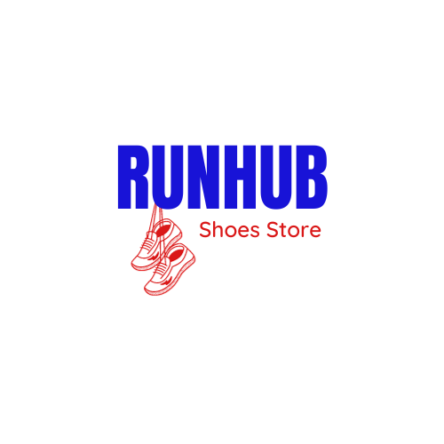
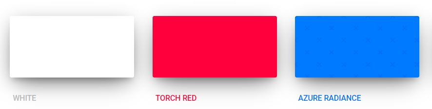
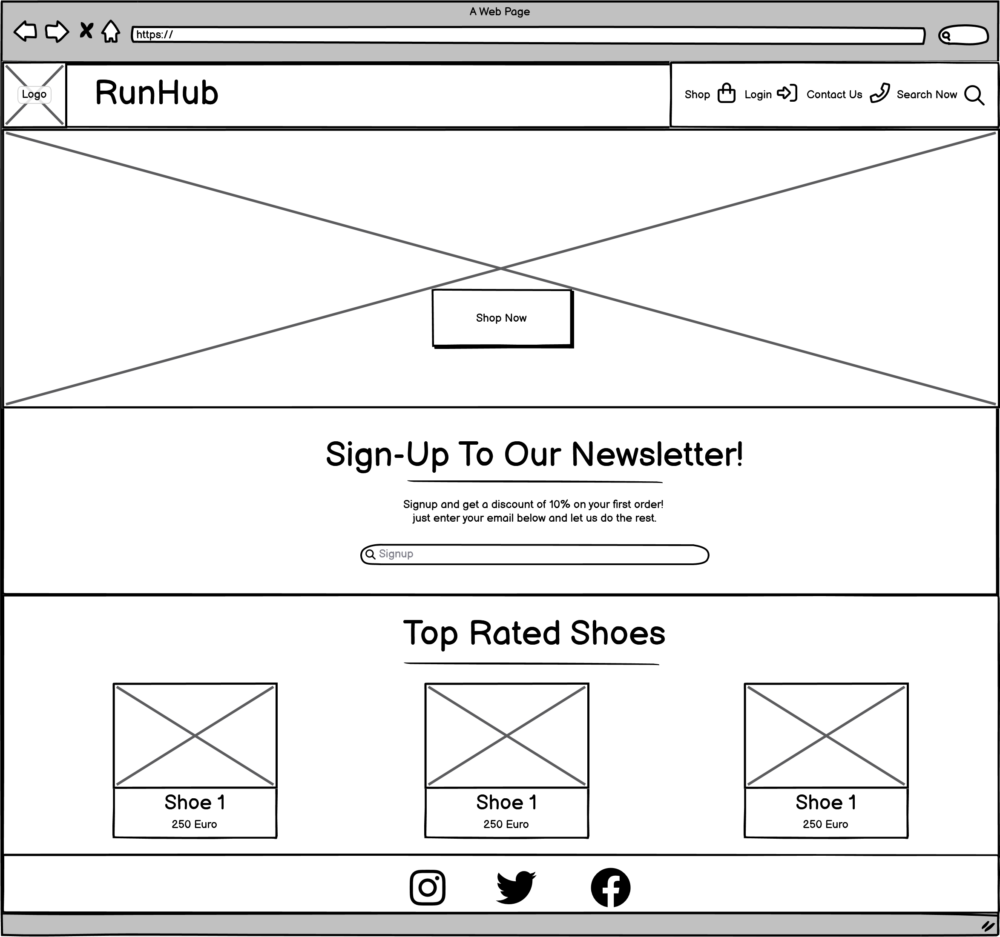
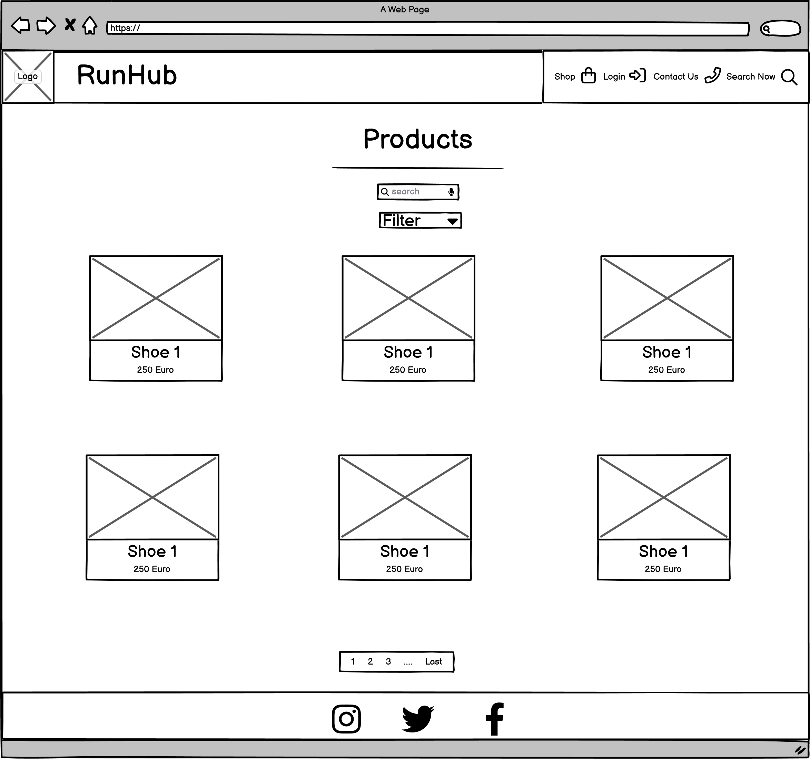
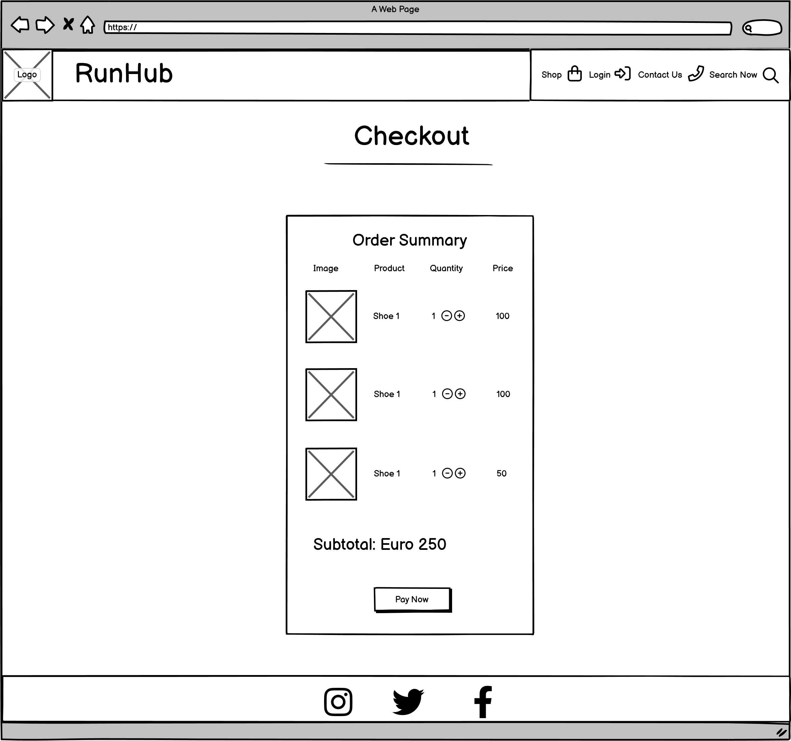
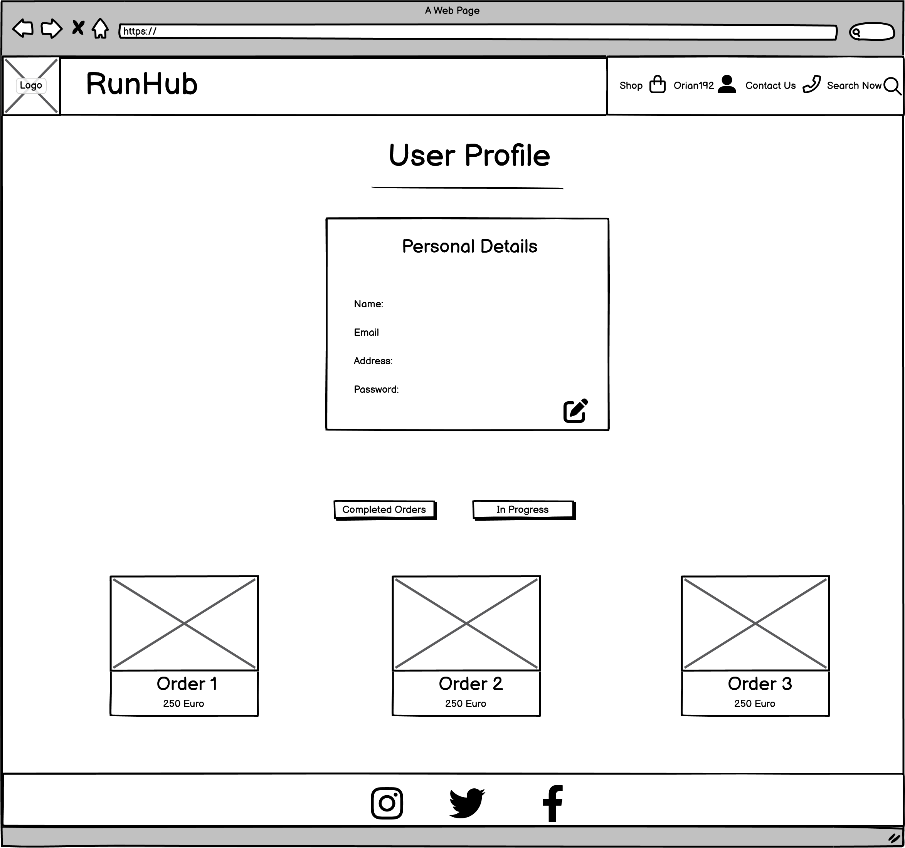
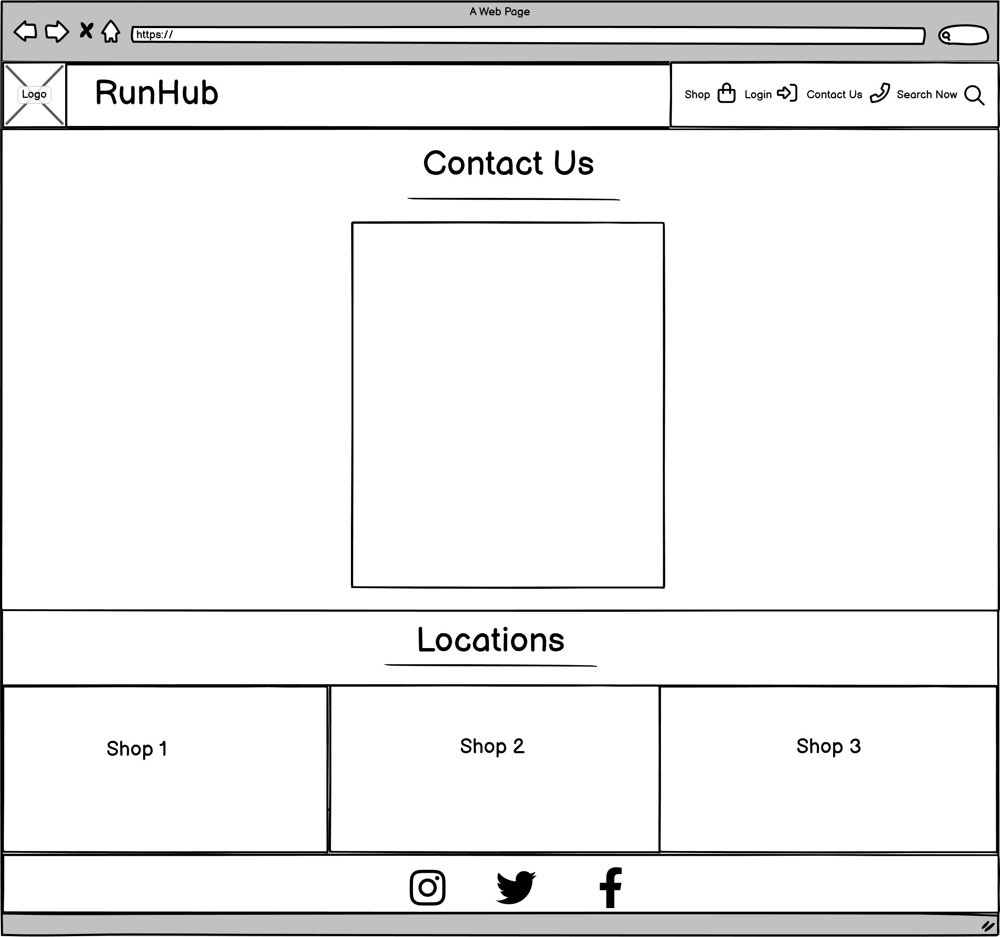
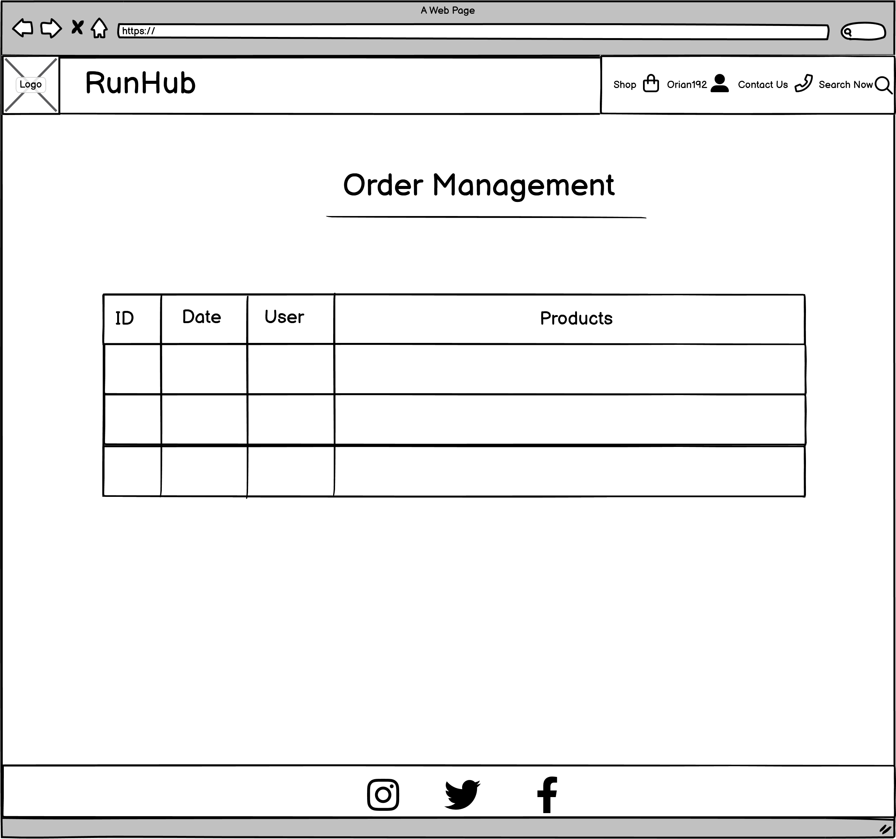

## Table of Contents

- [Table of Contents](#table-of-contents)
- [Business Plan](#business-plan)
  - [Executive Summary](#executive-summary)
  - [Market Analysis](#market-analysis)
  - [Marketing and Sales Strategy](#marketing-and-sales-strategy)
  - [Operations and Management](#operations-and-management)
    - [Financial Plan](#financial-plan)
      - [Revenue Streams:](#revenue-streams)
      - [Expenses:](#expenses)
      - [Financing:](#financing)
      - [Revenue Projections (Annual):](#revenue-projections-annual)
      - [Profitability:](#profitability)
  - [Conclusion](#conclusion)
- [Marketing](#marketing)
  - [Social Media](#social-media)
  - [Mailing List](#mailing-list)
- [Goals](#goals)
  - [User Goals](#user-goals)
  - [Site Owner Goals](#site-owner-goals)
- [Agile Methodology](#agile-methodology)
  - [Prioritisation](#prioritisation)
  - [User Stories and Epics](#user-stories-and-epics)
- [Branding](#branding)
  - [Logo](#logo)
  - [Colors](#colors)
  - [Fonts](#fonts)
  - [UX](#ux)
- [Wireframes](#wireframes)
  - [Structure](#structure)
  - [Website pages](#website-pages)
- [Database](#database)
  - [ERD](#erd)
  - [Models](#models)
- [AWS](#aws)
- [Technologies Used](#technologies-used)
  - [Languages \& Frameworks](#languages--frameworks)
  - [Libraries \& Tools](#libraries--tools)
- [Features](#features)
  - [Existing Features](#existing-features)
  - [Future Features](#future-features)
- [Validation](#validation)
  - [HTML Validation](#html-validation)
  - [CSS Validation](#css-validation)
  - [JavaScript Validation](#javascript-validation)
  - [PEP8 Validation](#pep8-validation)
  - [Accessibility](#accessibility)
- [Lighthouse](#lighthouse)
  - [Desktop](#desktop)
- [Testing](#testing)
  - [Manual testing](#manual-testing)
  - [Automated testing](#automated-testing)
  - [Coverage](#coverage)
  - [Device Testing \& Browser compatibility](#device-testing--browser-compatibility)
- [Bugs](#bugs)
- [Deployment](#deployment)
  - [AWS S3 Bucket Setup](#aws-s3-bucket-setup)
  - [Stripe Endpoint](#stripe-endpoint)
  - [Heroku](#heroku)
  - [Fork Repository](#fork-repository)
  - [Clone Repository](#clone-repository)
- [Credits](#credits)
  - [Code](#code)
  - [Media](#media)
- [Acknowledgements](#acknowledgements)

## Business Plan  

### Executive Summary

Run Hub, a specialized retail store catering to Irish running enthusiasts, aims to capitalize on the thriving running industry. As the market increasingly shifts online, we are well-positioned to establish a strong digital presence, offering a diverse range of high-quality running shoes and personalized fitting services. Our competitive edge, coupled with strategic social media marketing and partnerships, will drive growth.

Operational excellence is key, with an experienced management team overseeing a secure cloud-based platform and efficient logistics through third-party fulfillment centers. In financial terms, we project revenue of €500,000 in year one, rising to €1 million by year three, with profitability achieved by year two. Initial funding includes personal investments and a seed round, with future financing options under consideration.

In summary, Run Hub is poised to become a leading player in the Irish running market, leveraging our unique retail approach and online strategies to meet the diverse needs of runners and drive sustainable growth.

### Market Analysis

Run Hub is a specialized retail store catering to the ever-growing market of running enthusiasts. The running industry is a robust and continually expanding sector with a passionate and dedicated consumer base. While brick-and-mortar stores remain a popular choice for purchasing running shoes, there's a noticeable shift towards online retail in recent years. This shift presents a significant opportunity for Run Hub to establish itself as a dominant player in the market.

In terms of competition, Run Hub will face competition from both traditional brick-and-mortar running stores and online retailers. However, we are confident that our store's unique selling points, such as a diverse range of high-quality running shoe brands, expert staff with in-depth knowledge, and personalized fitting services, will set us apart from our competitors and position us as the preferred choice for runners of all levels.

Regarding our target market, our primary focus will be on catering to the needs of runners from diverse skill levels and demographics. We understand that every runner is unique, and our store will offer a curated selection of running shoes tailored to suit different running styles and preferences. Additionally, we will explore partnerships with local running clubs and events to tap into the community of avid runners and build brand loyalty among this active and engaged customer base.

### Marketing and Sales Strategy

* <strong>Online Presence:</strong> Focus on online sales through an optimized e-commerce platform.
* <strong>Social Media Marketing:</strong> Leverage Instagram and Facebook for regular updates, stories, and influencer collaborations.
* <strong>Content Creation:</strong> Publish engaging blog posts and email newsletters for valuable running insights and offers.
* <strong>Online Advertising:</strong> Utilize Google AdWords for targeted advertising to capture potential customers actively searching for running gear.
* <strong>Customer Engagement:</strong> Provide support via email responses to assist and convert website visitors.
* <strong>Local Engagement:</strong> Maintain a local presence through event participation, sponsorships, and collaborations with fitness centers.
* <strong>Partnerships:</strong> Collaborate with gyms, trainers, and running clubs to offer exclusive discounts and drive traffic to the online store.

### Operations and Management

 Run Hub will be led by a dedicated team of experienced professionals. Our core team will comprise a CEO, CTO, and marketing and sales staff, all of whom bring a wealth of expertise in the running industry.

* <strong>CEO:</strong> Responsible for overall business strategy, decision-making, and team leadership.
* <strong>CTO:</strong> Oversees the technical aspects, including website management, technology upgrades, and software enhancements
* <strong>Marketing and Sales Staff:</strong> Responsible for driving sales through digital marketing, customer engagement, and partnerships.
* <strong>Operational Infrastructure:</strong> We will rely on an efficient operational infrastructure to support our business:
  - <strong>Cloud-Based Platform:</strong> Our website and software will be hosted on a secure cloud-based platform, ensuring scalability and reliability.
  - <strong>Payment Gateway:</strong> We will employ a trusted payment gateway for secure and efficient transaction processing.
  - <strong>Fulfillment Centers:</strong> To streamline product storage, packing, and shipping, we will partner with reputable third-party fulfillment centers. This approach will allow us to

#### Financial Plan

##### Revenue Streams:

* <strong>Product Sales:</strong> Run Hub will generate revenue through the sale of running shoes and related products via our e-commerce shop. We anticipate strong demand from the Irish running community.
* <strong>Software Sales:</strong> We will also offer specialized software to running clubs and societies in Ireland to help manage their operations efficiently.

##### Expenses:

* <strong>Marketing and Advertising:</strong> To drive website traffic and attract customers, we will allocate a significant portion of our budget to marketing and advertising efforts. This will include online campaigns, social media promotion, and potentially local events.
* <strong>Development Expenses:</strong> Ongoing development and maintenance of the e-commerce platform and software will be necessary to meet customer needs and stay competitive in the market.

##### Financing:

* <strong>Initial Funding:</strong> The initial capital for Run Hub will be secured through a combination of personal investments from the founders and a small seed round of funding. This funding will provide the necessary resources for business setup and initial operations.
* <strong>Future Funding:</strong> As the business grows, we will explore additional financing options, such as venture capital or a larger round of financing, to support expansion and marketing efforts.

##### Revenue Projections (Annual):

* <strong>Year 1 (2023):</strong> We anticipate generating €500,000 in revenue. This will consist of €300,000 from product sales and €200,000 from software sales. Given the growing interest in running in Ireland, we expect a strong start.
* <strong>Year 2 (2024):</strong> We forecast revenue to increase to €750,000, with €450,000 from product sales and €300,000 from software sales. As our brand gains recognition, we anticipate a significant uptick in sales.
* <strong>Year 3 (2025):</strong> Our projection for the third year is €1 million in revenue, with €600,000 from product sales and €400,000 from software sales. As our customer base expands and we fine-tune our operations, we expect continued growth.

##### Profitability:

* <strong>Break-Even:</strong> We expect to break even within the first year of operation, thanks to careful cost management and strong product sales.
* <strong>Profitability:</strong> By the second year, we anticipate achieving profitability, as revenue growth outpaces expenses. This positive trend is expected to continue in subsequent years.

Our financial plan for Run Hub is based on a comprehensive analysis of the Irish market, and we are confident that our revenue projections and profitability timeline are achievable as we establish a strong presence in the running industry.

### Conclusion

In conclusion, Run Hub, a dedicated retail establishment serving the Irish running community, is strategically positioned to thrive in the evolving running industry. Our unique approach, encompassing both online and personalized in-store services, is well-equipped to meet the diverse needs of runners. Backed by an experienced management team, a secure cloud-based infrastructure, and robust financial planning, we anticipate significant growth.

With a projected revenue of €500,000 in the first year and a profitable outlook by the second year, we are confident in our ability to become a prominent player in the Irish running market. Our commitment to operational excellence, unique offerings, and strategic marketing will propel us toward sustainable success.

## Marketing

### Social Media

Run Hub is more than just a store; it's a thriving community for running enthusiasts. Users can stay connected by following Run Hub on both Facebook and Instagram. The Facebook page serves as a platform for keeping members informed about upcoming events, sharing the latest features, and showcasing inspiring user-generated content. Meanwhile, on Instagram, the focus is on highlighting picturesque running routes, unveiling the newest gear, and providing an exclusive behind-the-scenes look into Run Hub's world. Join the Run Hub community on:

- Facebook
- Instagram

### Mailing List

For users who want to be in the know, Run Hub manages its mailing list with Mailchimp. By subscribing to the mailing list, users will receive regular updates about new features, upcoming events, and special promotions. Joining is a straightforward process; the user simply provides their email address on the website, and they'll begin receiving tailored email updates. Thanks to Mailchimp, the Run Hub team can segment the list, personalize emails, and measure the effectiveness of their email campaigns. By becoming part of the mailing list, users can stay well-informed and be among the first to discover the latest developments within the Run Hub community.

## Goals

### User Goals

- Easily find and purchase high-quality running shoes and related products.
- Receive personalized fitting services to meet their unique running needs.
- Stay updated on the latest running news and insights through the blog.
- Connect with the Run Hub team for inquiries, support, and guidance.

### Site Owner Goals

- Generate revenue through the sale of running products on the e-commerce platform and specialized software for running clubs and societies.
- Cultivate a devoted and engaged customer base by offering a user-friendly experience and top-notch products and services.
- Establish Run Hub as a trusted and influential brand in the running community.
- Achieve profitability and ensure sustainable, long-term growth in the running industry.

## Agile Methodology

### Prioritisation 

After creating a comprehensive list of criteria, I carefully assessed each user story with regard to its alignment with the overarching project goals. I then employed GitHub Projects to assign priorities to these user stories through the use of labels.

To determine these priorities, I applied the MoSCoW prioritization technique, a widely-adopted practice in agile project management. This method aids in making informed choices regarding the precedence of requirements or features during the development process. The technique categorizes requirements into four distinct groups:

- <strong>Must Have (M)</strong>: These are indispensable features that are non-negotiable and must be incorporated into the current release. They serve as the core functionality and are vital for the project's success.

- <strong>Should Have (S)</strong>: These features, while significant for enhancing the product, are not as critical as the "Must Have" items. They are essential for the overall project success but may be postponed to a subsequent release if necessary.

- <strong>Could Have (C)</strong>: These features are desirable but their absence does not impede the core functionality. They represent potential improvements or nice-to-haves that can be considered for inclusion if time and resources permit.

- <strong>Won't Have (W)</strong>: These are features considered unnecessary within the current project scope. They are deliberately excluded from the development process due to factors such as time constraints, technical limitations, or low business value. In my project, I did not employ a specific label to denote "Won't Have" user stories. Instead, during each sprint, if a user story couldn't be completed, it was moved to a "descoped" status to signify its exclusion from the project's scope.

It's worth noting that in my project, some user stories labeled as "Must Have" were not completed. This occurred because certain epics related to these user stories were descoped due to capacity limitations.

### User Stories and Epics

## Branding

### Logo

The Run Hub logo features the brand name "RUNHUB" in blue, with the "H" subtly extending its descender to form a loop from which a pair of running shoes hangs by their laces. The running shoes are depicted in vibrant red. The logo design creates a sense of unity between the brand name and the symbol, conveying that Run Hub is where runners come together to explore their passion for running. The hanging running shoes represent choice, customization, and individuality, as runners can find the perfect fit for their needs at Run Hub.

The color combination of blue and red is carefully chosen to evoke trust and excitement. The blue of the brand name establishes reliability and professionalism, while the red of the running shoes communicates energy and passion. This combination reflects the brand's commitment to delivering top-quality products and services that ignite the enthusiasm of the running community.

</img>

### Colors

-<strong>Torch Red</strong> The red color (#FF003D) symbolizes energy, passion, and action. It's an attention-grabbing and dynamic color that reflects the excitement and enthusiasm of the running community. Red signifies that Run Hub is a place where runners can find the products and services that drive them forward in their running journeys.

-<strong>Azure Radiance</strong> The blue color (#007BFF) represents trust, reliability, and professionalism. It's a calming and stable color that conveys the idea that Run Hub is a trustworthy and dependable source for running enthusiasts. Blue is also commonly associated with the sky and water, which aligns with the outdoor and nature-related aspects of running.

-<strong>White</strong> The white color (#FFFFFF) Creates a clean and simple canvas which will allow other elements such as the text, images and icons to stand out prominently.

</img>

### Fonts

- <strong>Raleway</strong>: The title font for Run Hub, epitomizes modern sophistication. Its clean and contemporary sans-serif design exudes professionalism and reliability, aligning perfectly with the brand's image. The font's elegance adds a touch of class, making it ideal for showcasing the brand's name and essential headings. Raleway's versatility ensures a consistent and visually pleasing identity that resonates with Run Hub's target audience.

- <strong>Open Sans</strong> The body font for Run Hub's website, is a beacon of clarity and readability. Its neutral sans-serif design ensures a comfortable reading experience, enhancing the accessibility of the content. The font's friendliness and approachability create a welcoming atmosphere, which is crucial for engaging visitors. Open Sans balances readability and style perfectly, making it the ideal choice for Run Hub's user-friendly approach. It contributes to the brand's professional image while ensuring that information is easily digestible and captures the audience's attention.

### UX 

## Wireframes

I employed Balsamiq for crafting wireframes in my project. This user-friendly wireframing tool facilitates the rapid and effortless creation of mockups for websites and applications. It provides a diverse array of pre-designed UI elements and supports seamless collaboration with my team. I've attached a PNG of the wireframes for you to review the project's design, layout, and workflow before moving forward with actual product development.

Wireframe Home
  
</img>

Wireframe Products
  
</img>

Wireframe Checkout
  
</img>

Wireframe User Profile
  
</img>

Wireframe Contact Us
  
</img>

Wireframe Manage Orders
  
</img>

### Structure

My website development approach will prioritize mobile devices, adopting a mobile-first mindset. To ensure optimal styling across different screen sizes, I will focus on the smallest screen size of the iPhone 5/SE (320px) and incorporate appropriate screen size breakpoints for responsive design.[Bootstrap breakpoints](https://getbootstrap.com/docs/5.0/layout/breakpoints/ "Bootstrap breakpoints").

| Screen Size | Breakpoint |
| ----------- | ---------- |
| x-small     | <576px     |
| small       | => 576px   |
| medium      | => 768px   |
| large       | => 992px   |
| x-large     | => 1200px  |

### Website pages

- Home
- Products
- Product Details
- User Profike
- Admin Manage Order
- Basket
- Checkout
- Contact
- Register
- Profile
- Login
- Logout
- Reset Password
- Register
- 404

## Database

### ERD  

### Models  

## AWS

## Technologies Used

### Languages & Frameworks

- HTML
- CSS
- Javascript
- Python
- Django

### Libraries & Tools

- [Am I Responsive](http://ami.responsivedesign.is/)
- [Balsamiq](https://balsamiq.com/)
- [Bootstrap v5.2](https://getbootstrap.com/)
- [Cloudinary](https://cloudinary.com/)
- [Favicon.io](https://favicon.io)
- [Chrome dev tools](https://developers.google.com/web/tools/chrome-devtools/)
- [Font Awesome](https://fontawesome.com/)
- [Git](https://git-scm.com/)
- [GitHub](https://github.com/)
- [Google Fonts](https://fonts.google.com/)
- [Heroku Platform](https://id.heroku.com/login)
- [AWS](https://aws.amazon.com/)
- [jQuery](https://jquery.com)
- [Postgres](https://www.postgresql.org/)
- [Summernote](https://summernote.org/)
- Validation:
  - [WC3 Validator](https://validator.w3.org/)
  - [Jigsaw W3 Validator](https://jigsaw.w3.org/css-validator/)
  - [JShint](https://jshint.com/)
  - [CI Python Liner(PEP8)](https://pep8ci.herokuapp.com/)
  - [Lighthouse](https://developers.google.com/web/tools/lighthouse/)
  - [Wave Validator](https://wave.webaim.org/)

## Features  

### Existing Features

### Future Features 

## Validation 

### HTML Validation

### CSS Validation

### JavaScript Validation

### PEP8 Validation

### Accessibility  

## Lighthouse

### Desktop

## Testing

### Manual testing

### Automated testing

### Coverage  

### Device Testing & Browser compatibility

## Bugs

## Deployment

### AWS S3 Bucket Setup

### Stripe Endpoint

### Heroku

1. Generate pipfile

   - Open the terminal and execute the command "pip3 freeze > requirements.txt" to generate a file containing all the necessary requirements.

2. Heroku Setup

   - Access the [Heroku website](https://www.heroku.com/ "Heroku Website").
   - Log in to your Heroku account and select <strong>Create an App</strong>.
   - Click on the <strong>New button</strong> and create an <strong>app</strong>.
   - Select a suitable name and choose your location.
   - Proceed to the <strong>Resources tab</strong>.
   - From the list of resources, pick <strong>Heroku Postgres</strong>.
   - Go to the <strong>Deploy tab</strong>.
   - Click on <strong>Connect to Github</strong> and find your repository.
   - Open the <strong>Settings</strong> tab.
   - Reveal Config Vars and include your Cloudinary, Database URL (from Heroku-Postgres), and Secret Key.

3. Heroku Deployment

   - Visit the <strong>Deploy tab</strong>.
   - Choose the <strong>main branch</strong> for deployment and activate <strong>automatic deployment</strong>.
   - Opt for <strong>manual deployment</strong> to build the application.

### Fork Repository

To create a duplicate of the repository on your account and make modifications without impacting the original project, follow these steps using the Fork feature on GitHub:

- Access the [repository page](https://github.com/Oran-123/CI-005-run-hub "repository page") on your account.
- In the top right corner of the page, click on the Fork button.
- A forked version of the project will be created and added to your repository.

### Clone Repository

To create a replica of the repository on your local machine, follow these steps using the Clone feature:

- Access the [repository page](https://github.com/Oran-123/Hook-n-Slice-Golf "repository page") on your account.
- Locate the green <strong>Code</strong> button above the code window and click on it.
- Choose your preferred format from <strong>HTTPS, SSH</strong>, or <strong>GitClub CLI</strong>, and copy the provided URL (preferably HTTPS).
- Open your Integrated Development Environment (IDE) and launch Git Bash.
- Enter the command <strong>git clone</strong> followed by the copied URL in the Git Bash terminal.
- The repository will be cloned, and a local copy will be created on your machine.

## Credits

### Code

### Media

## Acknowledgements

- Code Institute

